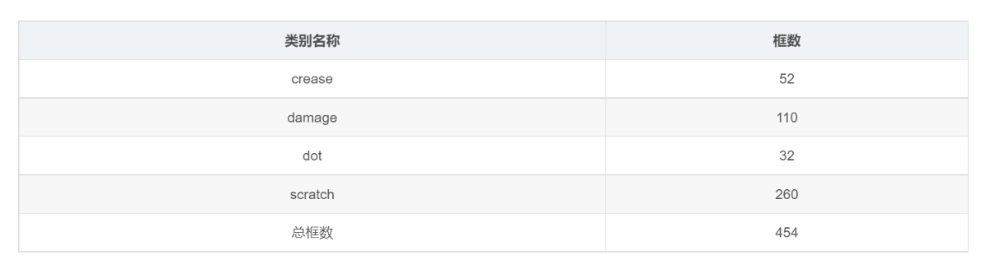
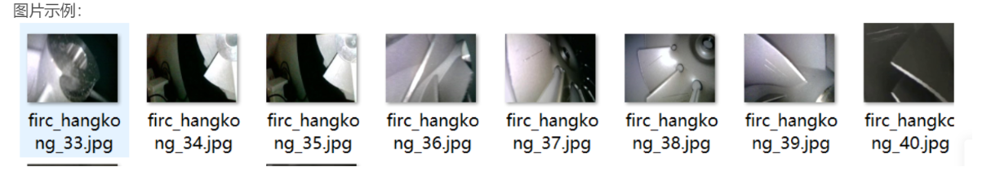

# Aero Engine Defect Detection Dataset VOC+YOLO Format, 291 Images in 4 Categories.rar

133.88MB rar

The dataset format: Pascal VOC format + YOLO format (excluding the split path's txt file, only including jpg images and corresponding VOC format xml files and YOLO format txt files).

Number of images (jpg file count): 291

Number of annotations (xml file count): 291

Number of annotations (txt file count): 291

Number of annotation categories: 4

Annotation category names: ["crease", "damage", "dot", "scratch"]

Number of boxes for each category:

- crease boxes = 52
- damage boxes = 110
- dot boxes = 32
- scratch boxes = 260

Total number of boxes: 454

Annotation tools used: labelImg

Annotation rules: draw a box around the categories

Important notes: There are no specific instructions provided at this time.

Special declaration: This dataset does not guarantee accuracy or weight files for trained models. The dataset provides accurate and reasonable annotations only.

## Images

Here is a pay link on Stripe ( https://buy.stripe.com/3cs8yP7sY87d0vu9AB ). Please contact me lonlonago@foxmail.com after funding $89, and I will send you a complete data files , thank you!

